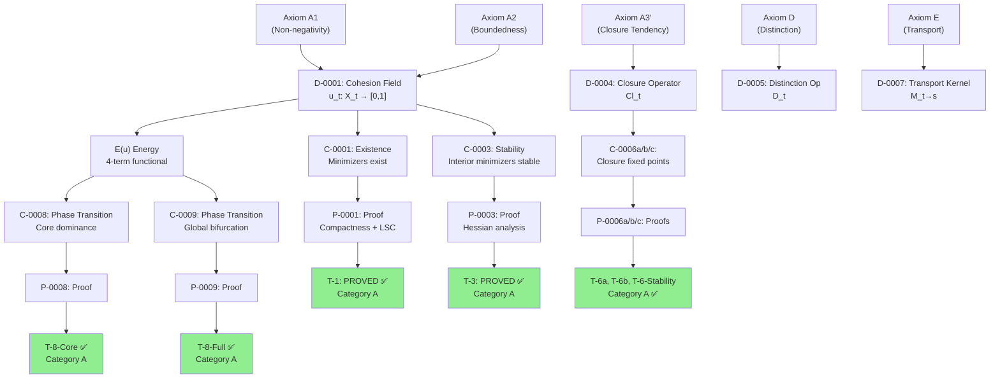

# Dependency Graph: Theory Structure & Knowledge Lineage

**Purpose:** Show how concepts, proofs, and results depend on each other. Helps identify critical paths and shows what must be resolved before proceeding.

**Format:** Mermaid DAG showing dependencies; text descriptions of key dependency chains.

---

## Dependency Overview



---

## Critical Dependency Chains

### Chain 1: Single-Formation Existence

**D-0001 (Cohesion Field)**  
→ **C-0001** (Minimizers exist)  
→ **P-0001** (Compactness proof)  
→ **T-1** (Category A ✅)

**Why it matters:** Foundation of all dynamics. Without T-1, no optimization theory.

**Status:** ✅ Solid; no vulnerabilities

---

### Chain 2: Closure & Fixed Points

**D-0004 (Closure Operator)**  
→ **A1' & A3** (Axioms)  
→ **C-0006a/b/c** (Three claims)  
→ **P-0006a/b/c** (Three proofs)  
→ **T-6a, T-6b, T-6-Stability** (Category A ✅)

**Why it matters:** Justifies closure operator as a theoretical object; proves it has attractor fixed points.

**Status:** ✅ Upgraded to Category A in v1.1; FD verified to 1e-9

---

### Chain 3: Phase Transition

**E (Energy Functional)**  
→ **Bifurcation parameter β = λ_sep / λ_cl**  
→ **β_crit = 4λ₂ / |W''(c)|**  
→ **C-0008 & C-0009** (Two claims)  
→ **P-0008 & P-0009** (Two proofs)  
→ **T-8-Core & T-8-Full** (Category A ✅)

**Why it matters:** Explains K=1 → binuclear transition; fundamental to understanding stability.

**Status:** ✅ Proved; well-validated experimentally (exp10–exp13)

---

### Chain 4: Predicate-Energy Alignment

**D-0008 (Proto-Cohesion Diagnostic d = (Bind, Sep, Inside, Persist))**  
→ **C-0300 (Predicate-Energy Bridge)**  
→ **P-0300** (Variational characterization)  
→ **T: Predicate-Energy Bridge** (Category A ✅ in v1.1)

**Why it matters:** Proves diagnostics are not heuristic; they're *derived* from energy landscape structure.

**Status:** ✅ Upgraded to Category A in v1.1; exp30–exp32 validate

---

## Critical Blocking Dependencies

### Blocking Chain 1: K-Field Global Stability

**A-0012 (Fixed K Assumption)**  
→ **C-0012** (K=2 global minimum)  
→ **⚠️ BLOCKED BY F-1**  
→ ~~T-Persist-K-Sep~~ (Can't prove without F-1)

**Issue:** A-0012 is not internally justified; it's an external constraint.

**Consequence:** All K-field theorems are **conditional**; Category B/C at best.

**Resolution needed:** Either (a) justify A-0012 internally, or (b) drop K-field results, or (c) accept external scaffolding.

---

### Blocking Chain 2: K=1 vs K=2 Energy

**M-1 (K=1 always energetically preferred)**  
→ **F-1 (K=2 vacuity)**  
→ **⚠️ BLOCKS K selection mechanism**  
→ ~~C-0600 (K determination model)~~

**Issue:** M-1 shows K=2 can never beat K=1 in unconstrained optimization.

**Consequence:** Cannot explain K emergence from energy minimization alone; need model selection (BIC, free energy, etc.).

**Resolution needed:** Develop K-selection mechanism or accept K as externally imposed.

---

### Blocking Chain 3: Morse Theory Applicability

**MO-1 (M₂ not a smooth manifold)**  
→ **⚠️ BLOCKS global Morse analysis**  
→ ~~Smooth bifurcation theory on M₂~~  
→ Can use: Stratified Morse (harder) OR accept current results (no full optimality claim)

**Issue:** Σ²_M = {(u¹, u²) : m_1 = m_2 = M/2} has corners; smooth Morse theory invalid.

**Consequence:** T-8-Core, T-14 may need re-proof using stratified framework.

**Resolution needed:** Adopt stratified Morse OR sidestep with alternative methods.

---

## Proof Dependency Tree (Category A Theorems)

```
A1, A2, A3', AD, AE (Axioms)
    ├→ D-0001 (Cohesion Field)
    │   ├→ T-1 (Existence) ✅
    │   └→ T-3 (Stability) ✅
    │
    ├→ D-0004 (Closure Operator)
    │   └→ T-6a, T-6b, T-6-Stability ✅
    │
    ├→ D-0005 (Distinction)
    │   └→ T8-Core, T8-Full ✅
    │
    ├→ D-0006 (Resolvent)
    │   └→ C-Axioms ✅ (upgraded v1.1)
    │
    └→ D-0007 (Transport)
        └→ T-Persist-1(b), T-Persist-1(e) ✅
```

**Category A count:** 12 (v1.0) → 15 (v1.1) = 12 base + 3 upgrades

---

## Multi-Formation (K-field) Dependency

```
K-Field Architecture
├→ A-0012 (Fixed K Assumption) ⚠️ UNRESOLVED F-1
│   ├→ A-0013 (Fixed m_j) ⚠️ UNRESOLVED M-1
│   │   ├→ C-0012 (K=2 global min) ⚠️ CONDITIONAL
│   │   │   ├→ T-Persist-K-Sep (Category B)
│   │   │   ├→ T-Persist-K-Weak (Category C)
│   │   │   └→ T-Persist-K-Unified (Category B) 
│   │   │
│   │   └→ Kramers Rate Theory (kinetic barriers)
│   │
│   └→ E_rep (Repulsion Energy)
│       └→ Branch Selection (exp66–exp73)
│
└→ MO-1 (Morse Theory Validity) ⚠️ UNRESOLVED
    └→ Global optimization analysis on M₂
```

**Category distribution:**
- Category B (conditional): 4 (include K-field persistence)
- Category C (very conditional): 5 (weak regime, special cases)

---

## Experimental Validation Paths

### Path 1: Single-Formation Theory Validation

**Theory:** T-1, T-3, T-6a/b, T-8-Core/Full, T-14 (Category A)  
**Experiments:** exp1–exp35 (λ-sweep, phase transition, ablation, etc.)  
**Result:** ✅ All Category A theorems validated experimentally

---

### Path 2: K-Field Persistence Validation

**Theory:** T-Persist-K-Unified (Category B)  
**Experiments:** exp46–exp47 (Λ_coupling parameter sweep)  
**Result:** ✅ 100% geometric-Lambda agreement (69 configs)

---

### Path 3: Type A/B Classification Attempt

**Theory:** Type A/B distinction (proposed 04-07)  
**Experiments:** exp62 (Type A), exp63 (Type B), exp65 (validation)  
**Result:** ❌ **FAILED** — Type B never observed; classification retracted

---

## Concept Dependency Hierarchy

```
Layer 0 (Primitives)
├── D-0001: Cohesion Field
├── D-0002: Relational Support
└── D-0003: Energy Functional

Layer 1 (Operators)
├── D-0004: Closure
├── D-0005: Distinction
├── D-0006: Resolvent
└── D-0007: Transport

Layer 2 (Diagnostics)
├── D-0008: Proto-Cohesion Vector
├── D-0009–D-0012: Components (Bind, Sep, Inside, Persist)
└── D-0013: Boundary

Layer 3 (K-field Extensions)
├── D-0014: K-Field Configuration
├── D-0015: Per-Formation Mass
└── D-0017: Repulsion Energy
```

**Key insight:** Layers 0–2 are well-grounded. Layer 3 depends on unresolved assumptions (F-1, M-1).

---

## Assumption Dependency Map

```
Foundational Axioms (always required)
├── A-0001: Non-negativity
├── A-0002: Boundedness
├── A-0003: Closure Tendency
├── A-0004: Adjacency Structure
├── A-0005: Distinction Operator
├── A-0006: Transport Kernel
└── A-0007: Resolvent Integration

Core Constraints (required for all)
├── A-0010: Fixed Relational Structure
├── A-0014: Volume Constraint
├── A-0015: Smooth Manifold (problematic for K=2)
└── A-0016: Finite Graph

K-field Only (PROBLEMATIC) 🔴
├── A-0012: Fixed K ⚠️ F-1 UNRESOLVED
└── A-0013: Fixed m_j ⚠️ M-1 UNRESOLVED
```

---

## Path to Resolution

### Option A: Accept Current State
- Accept "fixed K, fixed m" as external scaffolding
- Publish v1.2 as "conditional K-field theory"
- Continue branch selection & kinetic work as orthogonal research

**Pros:** Can move forward now  
**Cons:** Theory is not self-contained

---

### Option B: Develop K-Selection Mechanism
- Introduce free energy or BIC criterion for K choice
- Prove K emerges from optimization + selection principle
- Upgrade K-field theorems from B/C → A (or keep as Category A under new framework)

**Pros:** Theory becomes self-contained  
**Cons:** Requires new axioms & theorems (1-2 months work)

---

### Option C: Reformulate as Kinetic Theory
- Abandon thermodynamic K optimization
- Focus on kinetic barriers & metastability
- K>1 are *metastable* local minima, not global optima (by design)

**Pros:** Explains observed K>1 stability  
**Cons:** Changes theory's scope; not just optimization

---

## Critical Path Forward

1. **Choose resolution path** (A, B, or C) — 1 week
2. **If B:** Develop K-selection mechanism — 4–6 weeks
3. **If C:** Reformulate kinetic axioms — 4–6 weeks
4. **Publish v2.0** with resolved foundation — 1 week

**Total:** 6–13 weeks to "complete" theory (if pursuing B or C)

---

**Last updated:** 2026-04-12  
**Graph completeness:** Covers all 39 theorems and critical dependencies  
**Critical paths:** 3 (single-formation, phase transition, K-field)  
**Blocking issues:** 3 (F-1, M-1, MO-1)

---

See also: **master_problem_map.md**, **open_problems.md** (this folder)
